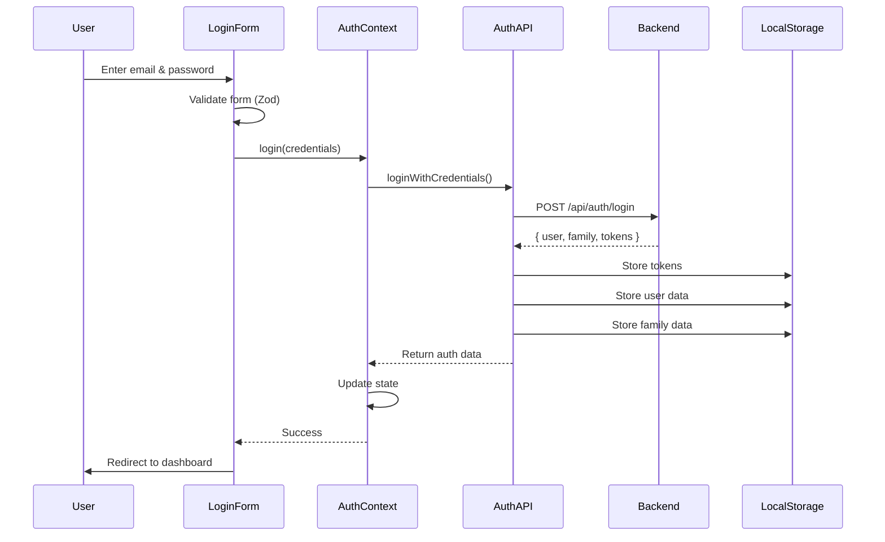
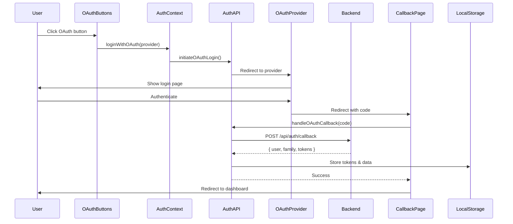
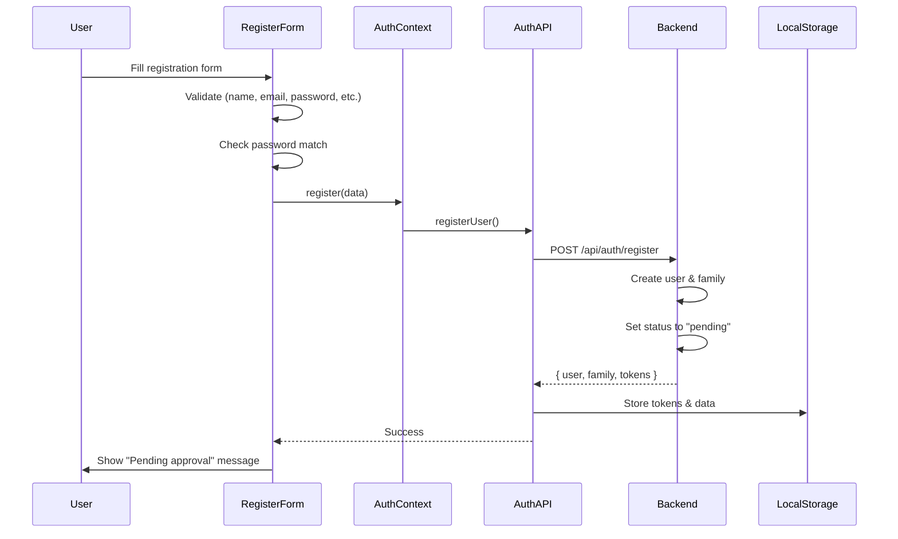
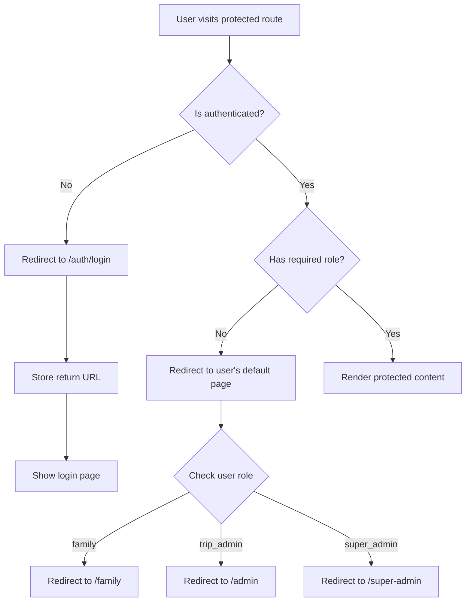
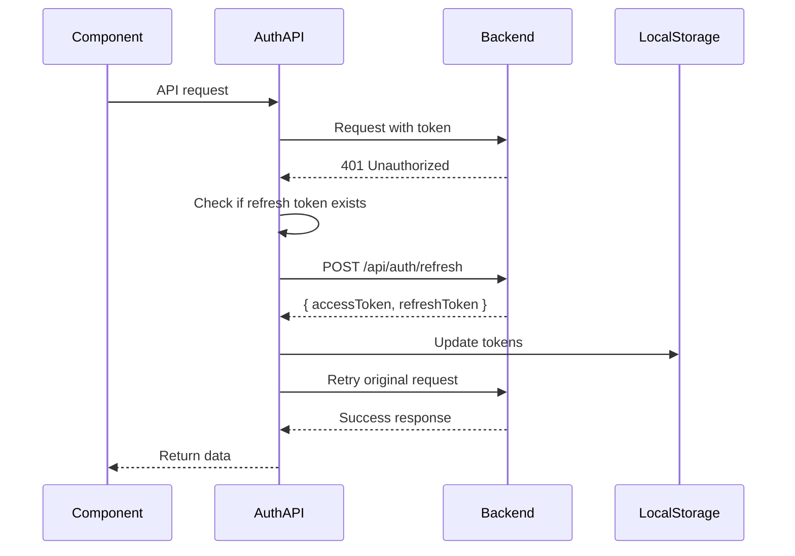
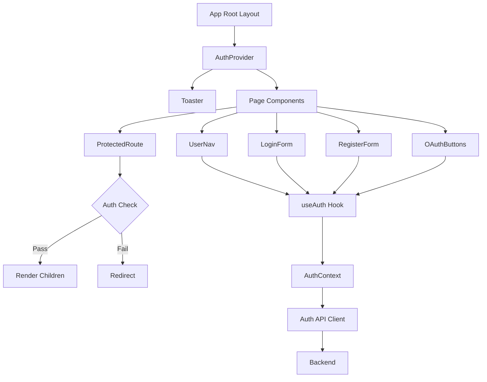
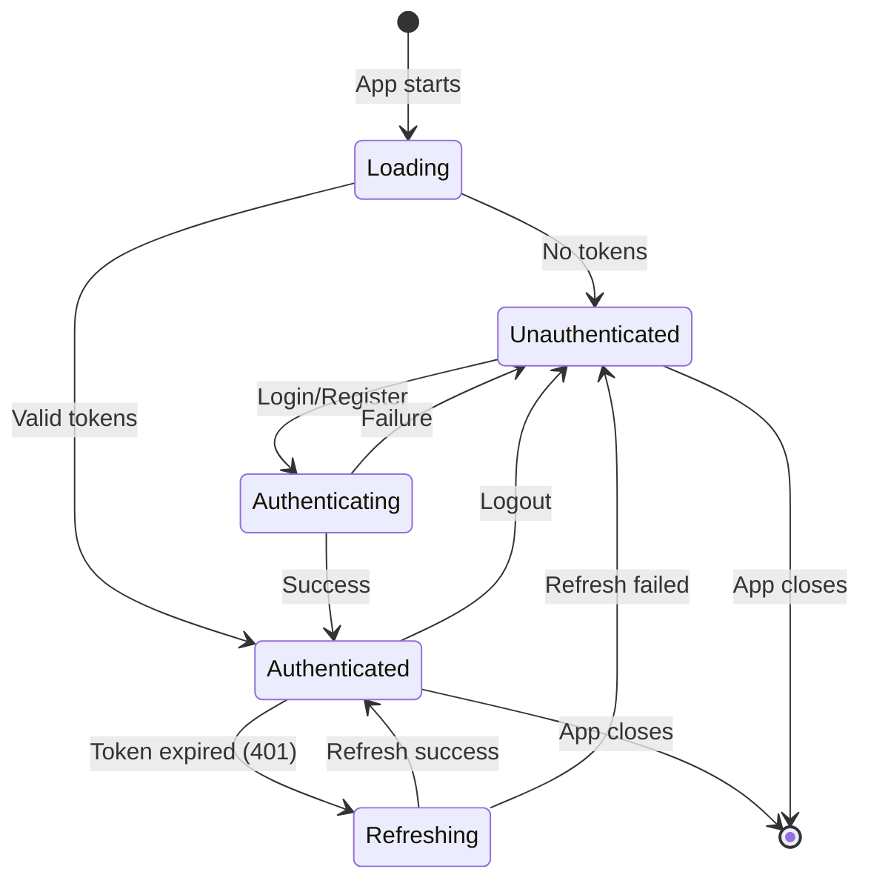
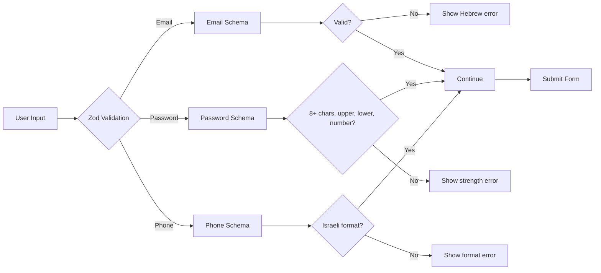
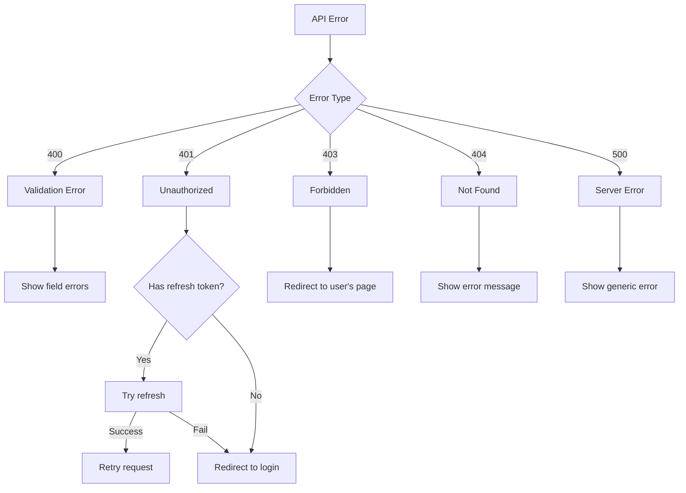

# Authentication Flow Diagrams

## 1. Login Flow (Email/Password)



## 2. OAuth Flow (Google/Facebook)



## 3. Registration Flow



## 4. Protected Route Flow



## 5. Token Refresh Flow



## 6. Component Architecture



## 7. State Management



## 8. Validation Flow



## 9. Role-Based Access

```mermaid
graph TD
    A[User] --> B{Role}
    
    B -->|family| C[Family Routes]
    C --> C1[/family]
    C --> C2[/family/trips]
    C --> C3[/profile]
    
    B -->|trip_admin| D[Trip Admin Routes]
    D --> D1[/admin]
    D --> D2[/admin/trip/:id]
    D --> D3[All family routes]
    
    B -->|super_admin| E[Super Admin Routes]
    E --> E1[/super-admin]
    E --> E2[/super-admin/activity-log]
    E --> E3[All other routes]
```

## 10. Error Handling



---

## Component Dependencies

```
AuthContext
    ├── Uses: auth API client
    ├── Provides: user, family, isAuthenticated, login, logout, etc.
    └── Used by: All auth components

LoginForm
    ├── Uses: AuthContext, validation schemas
    └── Renders: Email field, password field, submit button

RegisterForm
    ├── Uses: AuthContext, validation schemas
    └── Renders: Name, email, password, phone, family name fields

OAuthButtons
    ├── Uses: AuthContext
    └── Renders: Google button, Facebook button

ProtectedRoute
    ├── Uses: AuthContext
    ├── Checks: Authentication, roles
    └── Renders: Children or redirects

UserNav
    ├── Uses: AuthContext
    └── Renders: Avatar, dropdown menu, logout button

AuthStatus
    ├── Uses: AuthContext
    └── Renders: Role badge
```

---

## Key Points

### Security
1. Tokens stored in localStorage (consider httpOnly cookies for production)
2. Automatic token refresh on 401
3. Password strength validation enforced
4. Role-based access control at route level

### UX
1. Loading states for all async operations
2. Hebrew error messages throughout
3. RTL layout support
4. Smooth redirects with return URLs
5. Toast notifications for user feedback

### Developer Experience
1. TypeScript for type safety
2. Zod for runtime validation
3. React Hook Form for form management
4. Reusable components
5. Clean API with useAuth hook
